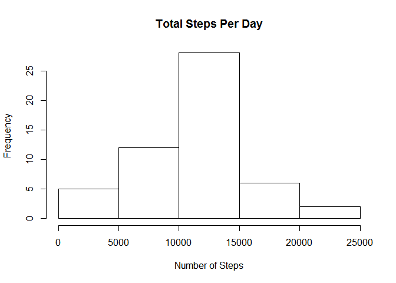
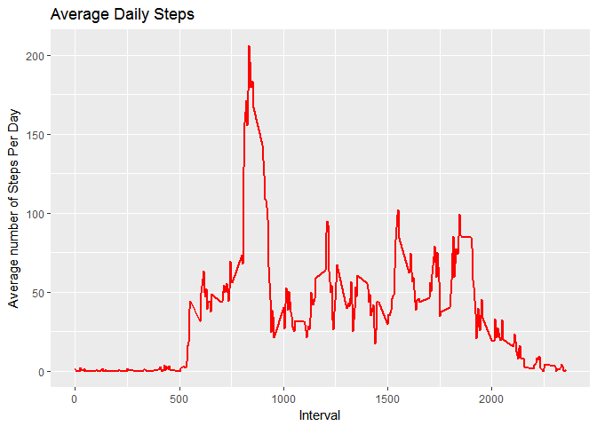
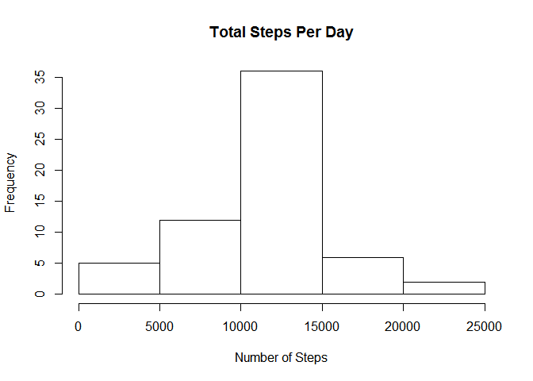
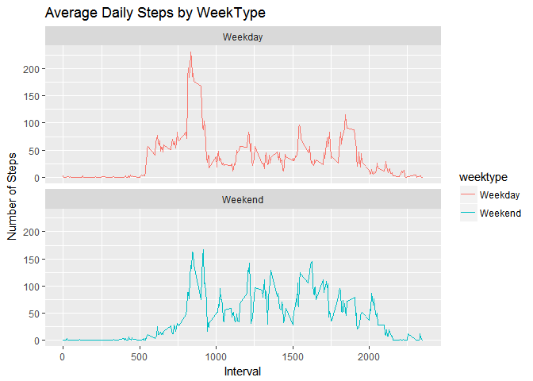

# Reproducible Research: Peer Assessment 1

## Loading applicable libraries

```r
   library(plyr)
   library(dplyr)
```

```
## 
## Attaching package: 'dplyr'
```

```
## The following objects are masked from 'package:plyr':
## 
##     arrange, count, desc, failwith, id, mutate, rename, summarise,
##     summarize
```

```
## The following objects are masked from 'package:stats':
## 
##     filter, lag
```

```
## The following objects are masked from 'package:base':
## 
##     intersect, setdiff, setequal, union
```

```r
   library(knitr)
   library(ggplot2)
```

```
## Warning: package 'ggplot2' was built under R version 3.3.2
```

## set Knitr global options to always echo code chunks

```r
   knitr::opts_chunk$set(echo = TRUE) 
```

## Loading and preprocessing the data
Show any code that is needed to

1. Load the data (i.e. read.csv())

2. Process/transform the data (if necessary) into a format suitable for your analysis


```r
   activitydf <- read.csv("activity.csv", header=TRUE, sep=",", colClasses=c("numeric","character","numeric"), stringsAsFactors = FALSE, na.strings = "NA")
```

## What is mean total number of steps taken per day?
For this part of the assignment, you can ignore the missing values in the dataset.

1. Calculate the total number of steps taken per day


```r
   mydf <- activitydf[complete.cases(activitydf),]
   steps_per_day <- aggregate(steps ~ date, data = mydf, FUN = "sum", na.rm = TRUE)
   steps_per_day
```

```
##          date steps
## 1  2012-10-02   126
## 2  2012-10-03 11352
## 3  2012-10-04 12116
## 4  2012-10-05 13294
## 5  2012-10-06 15420
## 6  2012-10-07 11015
## 7  2012-10-09 12811
## 8  2012-10-10  9900
## 9  2012-10-11 10304
## 10 2012-10-12 17382
## 11 2012-10-13 12426
## 12 2012-10-14 15098
## 13 2012-10-15 10139
## 14 2012-10-16 15084
## 15 2012-10-17 13452
## 16 2012-10-18 10056
## 17 2012-10-19 11829
## 18 2012-10-20 10395
## 19 2012-10-21  8821
## 20 2012-10-22 13460
## 21 2012-10-23  8918
## 22 2012-10-24  8355
## 23 2012-10-25  2492
## 24 2012-10-26  6778
## 25 2012-10-27 10119
## 26 2012-10-28 11458
## 27 2012-10-29  5018
## 28 2012-10-30  9819
## 29 2012-10-31 15414
## 30 2012-11-02 10600
## 31 2012-11-03 10571
## 32 2012-11-05 10439
## 33 2012-11-06  8334
## 34 2012-11-07 12883
## 35 2012-11-08  3219
## 36 2012-11-11 12608
## 37 2012-11-12 10765
## 38 2012-11-13  7336
## 39 2012-11-15    41
## 40 2012-11-16  5441
## 41 2012-11-17 14339
## 42 2012-11-18 15110
## 43 2012-11-19  8841
## 44 2012-11-20  4472
## 45 2012-11-21 12787
## 46 2012-11-22 20427
## 47 2012-11-23 21194
## 48 2012-11-24 14478
## 49 2012-11-25 11834
## 50 2012-11-26 11162
## 51 2012-11-27 13646
## 52 2012-11-28 10183
## 53 2012-11-29  7047
```

2. If you do not understand the difference between a histogram and a barplot, research the difference between them.

Make a histogram of the total number of steps taken each day


```r
   hist(steps_per_day$steps, main = "Total Steps Per Day", xlab="Number of Steps")
```

<!-- -->

3. Calculate and report the mean and median of the total number of steps taken per day


```r
   mean(steps_per_day$steps)
```

```
## [1] 10766.19
```

```r
   median(steps_per_day$steps)
```

```
## [1] 10765
```
** The mean number of total steps taken per day was 10766

** The median number of total steps taken per day was 10765

## What is the average daily activity pattern?
Processing the data per time interval


```r
   average_daily_activity <- aggregate(steps ~ interval, data = activitydf, FUN = "mean", na.rm = TRUE)
   head(average_daily_activity)
```

```
##   interval     steps
## 1        0 1.7169811
## 2        5 0.3396226
## 3       10 0.1320755
## 4       15 0.1509434
## 5       20 0.0754717
## 6       25 2.0943396
```

1. Make a time series plot (i.e. type = "l") of the 5-minute interval (x-axis) and the average number of steps taken, averaged across all days (y-axis)


```r
   ggplot(average_daily_activity, aes(x =interval , y=steps)) +
   geom_line(color="red", size=1) +
   labs(title = "Average Daily Steps", x = "Interval", y = "Average number of Steps Per Day")
```

<!-- -->

2. Which 5-minute interval, on average across all the days in the dataset, contains the maximum number of steps?


```r
   average_daily_activity[which.max(average_daily_activity$steps),]
```

```
##     interval    steps
## 104      835 206.1698
```

** Interval 835 has the maximum of 206.17 steps

## Imputing missing values
Note that there are a number of days/intervals where there are missing values (coded as NA). The presence of missing days may introduce bias into some calculations or summaries of the data.

1. Calculate and report the total number of missing values in the dataset (i.e. the total number of rows with NAs)


```r
   sum_missing_values <- sum(is.na(activitydf$steps))
   sum_missing_values
```

```
## [1] 2304
```

** The total sumber of NA occurences in steps column is 2304 

2. Devise a strategy for filling in all of the missing values in the dataset. The strategy does not need to be sophisticated. For example, you could use the mean/median for that day, or the mean for that 5-minute interval, etc. 

I chose the mean for the 5-minute interval.


```r
   interval_average <- tapply(activitydf$steps, activitydf$interval, mean, na.rm=TRUE, simplify = TRUE)
   interval_average
```

```
##           0           5          10          15          20          25 
##   1.7169811   0.3396226   0.1320755   0.1509434   0.0754717   2.0943396 
##          30          35          40          45          50          55 
##   0.5283019   0.8679245   0.0000000   1.4716981   0.3018868   0.1320755 
##         100         105         110         115         120         125 
##   0.3207547   0.6792453   0.1509434   0.3396226   0.0000000   1.1132075 
##         130         135         140         145         150         155 
##   1.8301887   0.1698113   0.1698113   0.3773585   0.2641509   0.0000000 
##         200         205         210         215         220         225 
##   0.0000000   0.0000000   1.1320755   0.0000000   0.0000000   0.1320755 
##         230         235         240         245         250         255 
##   0.0000000   0.2264151   0.0000000   0.0000000   1.5471698   0.9433962 
##         300         305         310         315         320         325 
##   0.0000000   0.0000000   0.0000000   0.0000000   0.2075472   0.6226415 
##         330         335         340         345         350         355 
##   1.6226415   0.5849057   0.4905660   0.0754717   0.0000000   0.0000000 
##         400         405         410         415         420         425 
##   1.1886792   0.9433962   2.5660377   0.0000000   0.3396226   0.3584906 
##         430         435         440         445         450         455 
##   4.1132075   0.6603774   3.4905660   0.8301887   3.1132075   1.1132075 
##         500         505         510         515         520         525 
##   0.0000000   1.5660377   3.0000000   2.2452830   3.3207547   2.9622642 
##         530         535         540         545         550         555 
##   2.0943396   6.0566038  16.0188679  18.3396226  39.4528302  44.4905660 
##         600         605         610         615         620         625 
##  31.4905660  49.2641509  53.7735849  63.4528302  49.9622642  47.0754717 
##         630         635         640         645         650         655 
##  52.1509434  39.3396226  44.0188679  44.1698113  37.3584906  49.0377358 
##         700         705         710         715         720         725 
##  43.8113208  44.3773585  50.5094340  54.5094340  49.9245283  50.9811321 
##         730         735         740         745         750         755 
##  55.6792453  44.3207547  52.2641509  69.5471698  57.8490566  56.1509434 
##         800         805         810         815         820         825 
##  73.3773585  68.2075472 129.4339623 157.5283019 171.1509434 155.3962264 
##         830         835         840         845         850         855 
## 177.3018868 206.1698113 195.9245283 179.5660377 183.3962264 167.0188679 
##         900         905         910         915         920         925 
## 143.4528302 124.0377358 109.1132075 108.1132075 103.7169811  95.9622642 
##         930         935         940         945         950         955 
##  66.2075472  45.2264151  24.7924528  38.7547170  34.9811321  21.0566038 
##        1000        1005        1010        1015        1020        1025 
##  40.5660377  26.9811321  42.4150943  52.6603774  38.9245283  50.7924528 
##        1030        1035        1040        1045        1050        1055 
##  44.2830189  37.4150943  34.6981132  28.3396226  25.0943396  31.9433962 
##        1100        1105        1110        1115        1120        1125 
##  31.3584906  29.6792453  21.3207547  25.5471698  28.3773585  26.4716981 
##        1130        1135        1140        1145        1150        1155 
##  33.4339623  49.9811321  42.0377358  44.6037736  46.0377358  59.1886792 
##        1200        1205        1210        1215        1220        1225 
##  63.8679245  87.6981132  94.8490566  92.7735849  63.3962264  50.1698113 
##        1230        1235        1240        1245        1250        1255 
##  54.4716981  32.4150943  26.5283019  37.7358491  45.0566038  67.2830189 
##        1300        1305        1310        1315        1320        1325 
##  42.3396226  39.8867925  43.2641509  40.9811321  46.2452830  56.4339623 
##        1330        1335        1340        1345        1350        1355 
##  42.7547170  25.1320755  39.9622642  53.5471698  47.3207547  60.8113208 
##        1400        1405        1410        1415        1420        1425 
##  55.7547170  51.9622642  43.5849057  48.6981132  35.4716981  37.5471698 
##        1430        1435        1440        1445        1450        1455 
##  41.8490566  27.5094340  17.1132075  26.0754717  43.6226415  43.7735849 
##        1500        1505        1510        1515        1520        1525 
##  30.0188679  36.0754717  35.4905660  38.8490566  45.9622642  47.7547170 
##        1530        1535        1540        1545        1550        1555 
##  48.1320755  65.3207547  82.9056604  98.6603774 102.1132075  83.9622642 
##        1600        1605        1610        1615        1620        1625 
##  62.1320755  64.1320755  74.5471698  63.1698113  56.9056604  59.7735849 
##        1630        1635        1640        1645        1650        1655 
##  43.8679245  38.5660377  44.6603774  45.4528302  46.2075472  43.6792453 
##        1700        1705        1710        1715        1720        1725 
##  46.6226415  56.3018868  50.7169811  61.2264151  72.7169811  78.9433962 
##        1730        1735        1740        1745        1750        1755 
##  68.9433962  59.6603774  75.0943396  56.5094340  34.7735849  37.4528302 
##        1800        1805        1810        1815        1820        1825 
##  40.6792453  58.0188679  74.6981132  85.3207547  59.2641509  67.7735849 
##        1830        1835        1840        1845        1850        1855 
##  77.6981132  74.2452830  85.3396226  99.4528302  86.5849057  85.6037736 
##        1900        1905        1910        1915        1920        1925 
##  84.8679245  77.8301887  58.0377358  53.3584906  36.3207547  20.7169811 
##        1930        1935        1940        1945        1950        1955 
##  27.3962264  40.0188679  30.2075472  25.5471698  45.6603774  33.5283019 
##        2000        2005        2010        2015        2020        2025 
##  19.6226415  19.0188679  19.3396226  33.3396226  26.8113208  21.1698113 
##        2030        2035        2040        2045        2050        2055 
##  27.3018868  21.3396226  19.5471698  21.3207547  32.3018868  20.1509434 
##        2100        2105        2110        2115        2120        2125 
##  15.9433962  17.2264151  23.4528302  19.2452830  12.4528302   8.0188679 
##        2130        2135        2140        2145        2150        2155 
##  14.6603774  16.3018868   8.6792453   7.7924528   8.1320755   2.6226415 
##        2200        2205        2210        2215        2220        2225 
##   1.4528302   3.6792453   4.8113208   8.5094340   7.0754717   8.6981132 
##        2230        2235        2240        2245        2250        2255 
##   9.7547170   2.2075472   0.3207547   0.1132075   1.6037736   4.6037736 
##        2300        2305        2310        2315        2320        2325 
##   3.3018868   2.8490566   0.0000000   0.8301887   0.9622642   1.5849057 
##        2330        2335        2340        2345        2350        2355 
##   2.6037736   4.6981132   3.3018868   0.6415094   0.2264151   1.0754717
```

3. Create a new dataset that is equal to the original dataset but with the missing data filled in.


```r
   na_filled_df <- activitydf
   na_logical <- is.na(na_filled_df$steps)
   na_filled_df$steps[na_logical] <- interval_average[as.character(na_filled_df$interval[na_logical])]
   ## head of the original dataset including NA
   ## head(activitydf)
   ## sum(is.na(activitydf))
   ## head of the simulated dataset has no NA
   head(na_filled_df)
```

```
##       steps       date interval
## 1 1.7169811 2012-10-01        0
## 2 0.3396226 2012-10-01        5
## 3 0.1320755 2012-10-01       10
## 4 0.1509434 2012-10-01       15
## 5 0.0754717 2012-10-01       20
## 6 2.0943396 2012-10-01       25
```

```r
   sum(is.na(na_filled_df))
```

```
## [1] 0
```

4. Make a histogram of the total number of steps taken each day and Calculate and report the mean and median total number of steps taken per day. 


```r
   sum_activity_filled_df <- aggregate(steps ~ date, data = na_filled_df, FUN = "sum", na.rm = TRUE)
   hist(sum_activity_filled_df$steps, main = "Total Steps Per Day", xlab="Number of Steps")
```

<!-- -->

```r
   sum_activity_filled_df
```

```
##          date    steps
## 1  2012-10-01 10766.19
## 2  2012-10-02   126.00
## 3  2012-10-03 11352.00
## 4  2012-10-04 12116.00
## 5  2012-10-05 13294.00
## 6  2012-10-06 15420.00
## 7  2012-10-07 11015.00
## 8  2012-10-08 10766.19
## 9  2012-10-09 12811.00
## 10 2012-10-10  9900.00
## 11 2012-10-11 10304.00
## 12 2012-10-12 17382.00
## 13 2012-10-13 12426.00
## 14 2012-10-14 15098.00
## 15 2012-10-15 10139.00
## 16 2012-10-16 15084.00
## 17 2012-10-17 13452.00
## 18 2012-10-18 10056.00
## 19 2012-10-19 11829.00
## 20 2012-10-20 10395.00
## 21 2012-10-21  8821.00
## 22 2012-10-22 13460.00
## 23 2012-10-23  8918.00
## 24 2012-10-24  8355.00
## 25 2012-10-25  2492.00
## 26 2012-10-26  6778.00
## 27 2012-10-27 10119.00
## 28 2012-10-28 11458.00
## 29 2012-10-29  5018.00
## 30 2012-10-30  9819.00
## 31 2012-10-31 15414.00
## 32 2012-11-01 10766.19
## 33 2012-11-02 10600.00
## 34 2012-11-03 10571.00
## 35 2012-11-04 10766.19
## 36 2012-11-05 10439.00
## 37 2012-11-06  8334.00
## 38 2012-11-07 12883.00
## 39 2012-11-08  3219.00
## 40 2012-11-09 10766.19
## 41 2012-11-10 10766.19
## 42 2012-11-11 12608.00
## 43 2012-11-12 10765.00
## 44 2012-11-13  7336.00
## 45 2012-11-14 10766.19
## 46 2012-11-15    41.00
## 47 2012-11-16  5441.00
## 48 2012-11-17 14339.00
## 49 2012-11-18 15110.00
## 50 2012-11-19  8841.00
## 51 2012-11-20  4472.00
## 52 2012-11-21 12787.00
## 53 2012-11-22 20427.00
## 54 2012-11-23 21194.00
## 55 2012-11-24 14478.00
## 56 2012-11-25 11834.00
## 57 2012-11-26 11162.00
## 58 2012-11-27 13646.00
## 59 2012-11-28 10183.00
## 60 2012-11-29  7047.00
## 61 2012-11-30 10766.19
```


```r
   steps_postfil_mean <- mean(sum_activity_filled_df$steps, na.rm=TRUE)
   steps_postfil_mean
```

```
## [1] 10766.19
```

```r
   steps_postfil_median <- median(sum_activity_filled_df$steps, na.rm=TRUE)
   steps_postfil_median
```

```
## [1] 10766.19
```

Do these values differ from the estimates from the first part of the assignment? 

Yes there is a slight difference with the median value.

** The mean number of total steps taken per day was 10766

** The median number of total steps taken per day was 10766

What is the impact of imputing missing data on the estimates of the total daily number of steps?

** Both the mean & median have become the same, yet the median has changed slightly from the previous results: 10765 --> 10766. 

The number of occurences (a.k.a frequency) has increased as expected

## Are there differences in activity patterns between weekdays and weekends?

For this part the weekdays() function may be of some help here. Use the dataset with the filled-in missing values for this part.

1. Create a new factor variable in the dataset with two levels - "weekday" and "weekend" indicating whether a given date is a weekday or weekend day.


```r
   na_filled_df$date <- as.POSIXct(na_filled_df$date)
   na_filled_df <- mutate(na_filled_df, weektype = ifelse(weekdays(na_filled_df$date)=="Saturday" | weekdays(na_filled_df$date)=="Sunday", "Weekend", "Weekday"))
   head(na_filled_df)
```

```
##       steps       date interval weektype
## 1 1.7169811 2012-10-01        0  Weekday
## 2 0.3396226 2012-10-01        5  Weekday
## 3 0.1320755 2012-10-01       10  Weekday
## 4 0.1509434 2012-10-01       15  Weekday
## 5 0.0754717 2012-10-01       20  Weekday
## 6 2.0943396 2012-10-01       25  Weekday
```


```r
   # group dataset by interval & weektype then compute mean on steps
   na_filled_df2<- na_filled_df %>% group_by(interval, weektype) %>%
        summarise(steps = mean(steps, na.rm=TRUE))
head(na_filled_df2)
```

```
## Source: local data frame [6 x 3]
## Groups: interval [3]
## 
##   interval weektype      steps
##      <dbl>    <chr>      <dbl>
## 1        0  Weekday 2.25115304
## 2        0  Weekend 0.21462264
## 3        5  Weekday 0.44528302
## 4        5  Weekend 0.04245283
## 5       10  Weekday 0.17316562
## 6       10  Weekend 0.01650943
```

2. Make a panel plot containing a time series plot (i.e. type = "l") of the 5-minute interval (x-axis) and the average number of steps taken, averaged across all weekday days or weekend days (y-axis). See the README file in the GitHub repository to see an example of what this plot should look like using simulated data.


```r
p <- ggplot(na_filled_df2, aes(x =interval , y=steps, color=weektype)) +
       geom_line() +
       labs(title = "Average Daily Steps by WeekType", x = "Interval", y = "Number of Steps") +
       facet_wrap(~weektype, ncol = 1, nrow=2)
p
```

<!-- -->

** The subject appears to be more active earlier in the day during the weekday and is more active throughout the weekend. 

** This is most likely due to the subject sitting a good portion of the time and hence explain the lesser movement during the weekdays' working hours.

